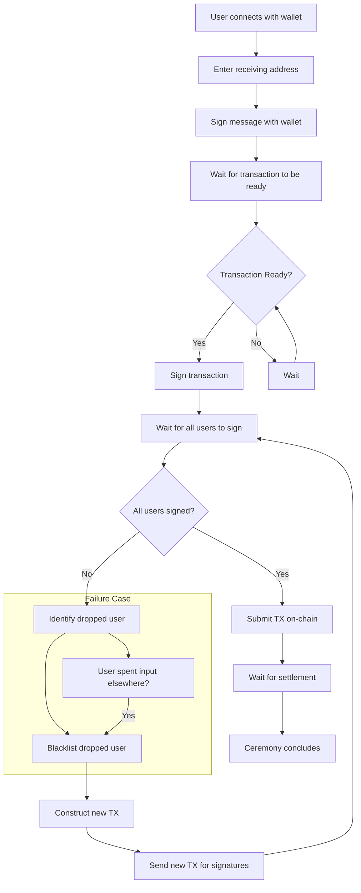

# Turn Classic

A coin-join style mixer for Ada and CNTs

## Story

1. Users make a call to a server signaling their intent to participate in a mixing ceremony. This call includes the address they wish to send from and the address they wish to receive to. This call also includes a signature from the users wallet. This signature ensures users have consented to the ceremony to prevent malicious actors from signing up on behalf of others in order to get them banned
2. once enough users have signaled intent a multisig tx is constructed and signatures are collected from each user. this tx also includes a small fee to the operator
3. should a user fail to sign the transaction within a given period of time they are dropped from the ceremony and their address is blacklisted. A new tx is constructed without the blacklisted user and is sent out again to collect new signatures
4. once the transaction has all required witnesses it is submitted on chain and the ceremony concludes
5. if at any point in the ceremony an input intended for use in the ceremony is spent in another tx, the owner of that input is dropped and blacklisted and a new tx is constructed


## Ceremony Diagram

<div style="height: 500px; overflow: auto;">



</div>


## Objects

### Ceremony Request For Inclusion

Details about a user who wants to be included in a ceremony

    Sending Address     : Payment Credential & Maybe Stake Credential
    Receiving Address   : Payment Credential & Maybe Stake Credential
    Signature           : String

### Ceremony

    Members     : List Ceremony Request For Inclusion 

### Completed Ceremonies 

    Ceremonies      : List Ceremony & Transaction Hash

### Ceremony Queue

    Queue       : Ceremony Request For Inclusion

### Blacklist Entry

    User Request        : Ceremony Request For Inclusion
    Reason              : Spent Input | Failed To Sign
    Date                : Number


## Running 

### Run Server Locally

    deno run --allow-net --allow-read --allow-env --allow-ffi --env-file --unstable-kv api.ts

## Other helpful commands

To see what is currently in the deno kv database

    deno task kv:show


To empty the deno kv database

    deno task kv:clear


## Balance Math

### Operator balance
Operator balance before transaction equals the balance after the transaction plus the network fee paid minus the operator fee multiplied by the number of participants


$$
\begin{aligned}
    &B_0 = B_1 + F_n - (F_o \cdot P) \\
    &\text{where} \\
    B_0 &\text{ is the operator's balance before the transaction} \\
    B_1 &\text{ is the operator's balance after the transaction} \\
    F_n &\text{ is the fee paid to the network} \\
    F_o &\text{ is the operator's fee} \\
    P &\text{ is the number of participants}
\end{aligned}
$$


This can be rearranged to 

$$
B_1 = B_0 - F_n + (F_o \cdot P)
$$

The operators balance after the transaction is equal to their initial balance minus the network fee plus the operator fee times the number of participants. 

### Participants Balance

The balance before the transaction is equal to the balance after the transaction plus the operator fee plus the amount sent to the receiving address


$$
\begin{aligned}
    &B_0 = B_1 + F_o + M \\
    &\text{where} \\
    B_0 &\text{ is the user's balance before the transaction} \\
    B_1 &\text{ is the user's balance after the transaction} \\
    F_o &\text{ is still the operator's fee} \\
    M &\text{ is the value sent by the user through the mixer}
\end{aligned}
$$


Rearranging for the balance after the transaction

$$
B_1 = B_0 - F_o - M
$$

The users balance after the transaction equals their initial balance minus the operator fee minus the mixed value

## Selecting inputs

You want to minimize the number of inputs per user. We do not necessarily want to consolidate everything remaining in a users wallet into a single utxo, simply because it will increase the size of the transaction and these eat into the profits of the operator. Additionally we want to keep the transaction as simple as possible. If a transaction consumes every token in your wallet it may take you longer to verify that all your assets are returned to your original address (change address). 

Therefore we want to pick a subset of the users utxos such that

- there is enough to match the value required by the mixer
- there is also enough to pay the operator
- if there is change (in most cases there will be) the amount is not so little that the change utxo does not meet the minUtxo requirement 


$$
\begin{aligned}
    &I > M + F_o + \text{minUTXO} \\
    &\text{where } I \text{ is the sum of the user's inputs present in the transaction}
\end{aligned}
$$


## Next steps

- [X] Transaction simulation to model variable number of participants (with `.reduce`)
- [X] design and implement server with Yaci

### Server implementation

- [X] remove clients from queue if they disconnect
- [X] add database so mixer can recover if server restarts
- [X] heartbeat
- [ ] fix WebSocket client management (currently seeing ghost "Client disconnected" messages due to stale WebSocket connections not being properly cleaned up)
- [ ] blacklist users who break the web connection while in an active ceremony
- [ ] remove and blacklist users who don't sign after some amount of time
- [ ] dotenv toggle to control whether or not the blacklist is checked


## Possible features

- Pay fee to remove self from blacklist
- pull parameters from an on-chain datum which can be updated by the TURN token holders

## dotenv

```ini
OPERATOR_MNEMONIC=""
NETWORK="" # options: LOCAL_TESTNET, PREVIEW_TESTNET, MAINNET
BLOCKFROST_API_KEY="" # only used for PREVIEW_TESTNET and MAINNET, not used for LOCAL_TESTNET

ADMIN_PORT="" # only used for LOCAL_TESTNET
OGMIOS_PORT="" # only used for LOCAL_TESTNET
KUPO_PORT="" # only used for LOCAL_TESTNET

```

## Working With Yaci

First, go to the folder where Yaci has been installed. You may need to edit the configuration. [See more](https://devkit.yaci.xyz/yaci_cli_distribution#configuration)

Start Yaci

    ./yaci-cli

Start a node inside Yaci

    create-node -o --start

Fund wallet (do this twice so you have at least two UTxOs)

    topup <address> <amount>

Fund Address #0

    topup addr_test1qryvgass5dsrf2kxl3vgfz76uhp83kv5lagzcp29tcana68ca5aqa6swlq6llfamln09tal7n5kvt4275ckwedpt4v7q48uhex 500000000

## Example Transactions

### 10 users

https://preview.cardanoscan.io/transaction/42bf1593b115d934ce88db69f4bc59b0b604fe4103881abb7b5d989b35910c02

### 20 users

https://preview.cardanoscan.io/transaction/7fe8f611b28c923dd17b7671e4c1705eef58b6001386f18e2687d788897ad745?tab=summary

### 30 users

https://preview.cardanoscan.io/transaction/963b06e44c018b7c4dd7d1496b52bbeec8930f65e507898476961bcc15fdc0e6

### 40 users

https://preview.cardanoscan.io/transaction/878d8f20a0f940617d94efa99709d2267596c139eedd36402246a7e264531386

### Digital Signatures

Please expect product announcements to come with a signed message containing all critical details. This includes new websites, tokens, or products. Don't trust, VERIFY! My signatures can be easily checked with the following site: 

https://verifycardanomessage.cardanofoundation.org/

My public key is a5010102583901a8adfd9249633f7bf0178a199edf3bc4ef071b403904cfd5f273ed1d0727ba7e3685b335ef03dbcaf6a43ae5659d3ed88677ddfb3691d14c03272006215820c46dce4d20a26e223530f4a242f7755cfc6192cc539b4a6f3361ead76bd003c2


## Resources

### CoinJoin initial post
https://bitcointalk.org/index.php?topic=279249.0

### Mixing Solutions in Bitcoin and Ethereum Ecosystems: A Review and Tutorial
https://arxiv.org/abs/2310.04899


